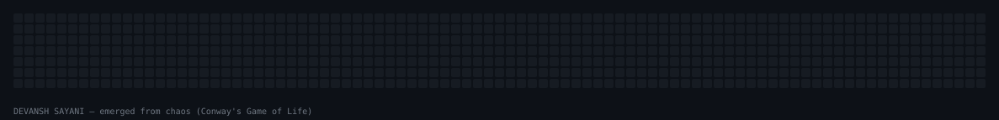

<!-- readme-banner:start -->
  
<!-- readme-banner:end -->

<h1 align="center"></h1>

<p align="center">
  <!-- add a one-line bio here -->
</p>

<p align="center"><i>The banner above rotates hourly between four hand-built SVG animations (snake · life · terminal · constellation). Come back later for a different one.</i></p>

---

## 🎞️ The gallery

Swap the `src` in the banner above for any of these. Each one loops forever on its own.

### 🐍 Snake reveal &nbsp;·&nbsp; `dist/devansh-snake.svg`
A pixel boy runs in, **throws a snake**, and it slithers across a contribution grid revealing my name in green — then he stands by the last letter and **dances** while music notes float up.

<p align="center"></p>

### 🧬 Game of Life &nbsp;·&nbsp; `dist/devansh-life.svg`
A random **soup of cells** evolves under Conway's real B3/S23 rules, boils for a few dozen generations, then **locks itself into my name**, holds, dissolves, and loops.

<p align="center"></p>

### 🖥️ Terminal build &nbsp;·&nbsp; `dist/devansh-terminal.svg`
A retro shell **types** `git show --render=profile`, runs a build with a progress bar, and **renders my name** as a green contribution banner — complete with a blinking typewriter cursor.

<p align="center"></p>

### ✨ Constellation &nbsp;·&nbsp; `dist/devansh-constellation.svg`
My name as a **star map**: each pixel is a star that twinkles in, neighbouring stars connect into letters with lines that **draw themselves on**, over a drifting field with a periodic shooting star.

<p align="center"></p>

---

<details>
<summary><b>Build & customize</b></summary>

<br/>

Requires Node 18+. No dependencies.

```bash
npm run build         # generate all four into dist/ + a gallery.html
npm run preview       # build, then open the gallery (macOS)

npm run snake         # or build just one piece:
npm run life
npm run terminal
npm run constellation
```

Each generator has a `CONFIG` block at the top of its file in `src/`
(`generate.js`, `conway.js`, `terminal.js`, `constellation.js`):

| Option | What it does |
| --- | --- |
| `name` | The text each piece spells out. |
| `greens` / `background` / `empty` | The contribution color ramp and grid colors. |
| `snake*`, `boy`, `sky`, `star`, `line` | Per-piece palette (snake body, the pixel boy, the night sky, …). |
| `cell`, `gap`, `rows`, `pad*` | Sizing. |
| `T` and the per-phase `*At` / `*Start` times | The animation timeline (seconds). |
| `seed` (life, constellation) | Reproducible "random" soup / starfield. |

The shared 5-row pixel font in `src/font.js` covers `A–Z`, `0–9` and some
punctuation — add a 5-row bitmap to `FONT` (`#` = filled pixel) for anything missing.

### How it works

- **Grids** (snake, life, terminal) rasterize the name onto a 7-row contribution grid via `src/font.js`.
- **Snake** follows a serpentine `<path>` with SMIL `animateMotion`; body segments trail the head, and each lit cell flips green exactly as the head arrives.
- **Game of Life** is simulated in Node, then every frame is baked into one compact discrete `<animate>` per cell — the browser just replays the simulation.
- **Terminal** types via a `clipPath` whose width steps across the command, with a block cursor riding the edge; status lines and the banner reveal on a shared clock.
- **Constellation** joins adjacent lit pixels into segments that draw on with `stroke-dashoffset`, while stars pop in with staggered keyframes.

MIT licensed.

</details>
