<p align="center">
  
</p>

<h1 align="center">Hi, I'm Devansh Sayani 👋</h1>

<p align="center">
  <!-- add a one-line bio here -->
</p>

---

<details>
<summary><b>About this banner</b> (built from scratch — no API, no GitHub Action)</summary>

<br/>

A self-contained animated **SVG**: a pixel boy runs in, **throws a snake**, then the snake
slithers across a GitHub-contribution-style grid and **reveals my name in green**. When it
finishes, the boy stands beside the final letter **I** and **dances** while music notes float
above his head. It's pure SVG + CSS/SMIL (no JavaScript), so it animates right inside this
README's `` tag.

### Build

```bash
npm run build      # writes dist/devansh-snake.svg
npm run preview    # build + open the SVG (macOS)
```

Requires Node 18+. No dependencies.

### Customize

Everything lives in `CONFIG` at the top of `src/generate.js`:

| Option | What it does |
| --- | --- |
| `name` | The text the snake spells out. |
| `greens` | The contribution color ramp for revealed cells. |
| `snake` / `snakeBand` / `snakeHead` | Snake body, banding and head colors. |
| `background` / `empty` | Page background and unlit-cell color. |
| `boy` | The pixel boy's skin / shirt / pants / hair / shoe colors. |
| `cell`, `gap`, `rows`, `padCols*` | Grid sizing. |
| `T` and the `*At` times | The animation timeline (seconds). |

To add letters that aren't defined yet, add a 5-row bitmap to `FONT` in `src/font.js`
(`#` = filled pixel).

### How it works

- The name is rasterized onto a grid using the pixel font in `src/font.js`.
- The snake follows a serpentine path through every cell via one shared `<path>` and SMIL
  `animateMotion`; body segments trail the head by a small time offset.
- Each lit cell has a CSS `@keyframes` that flips it to green exactly when the snake head
  arrives, so the name "draws itself" in sync with the snake.
- The boy is built from `<rect>`s and animated with nested CSS transforms (run cycle, throw,
  turn, bob/dance) plus floating `♪` notes.

MIT licensed.

</details>
